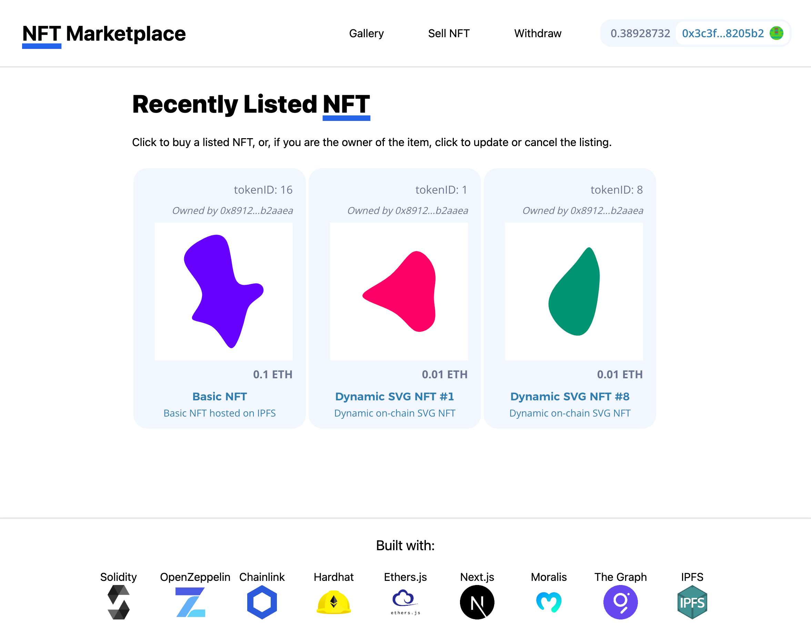
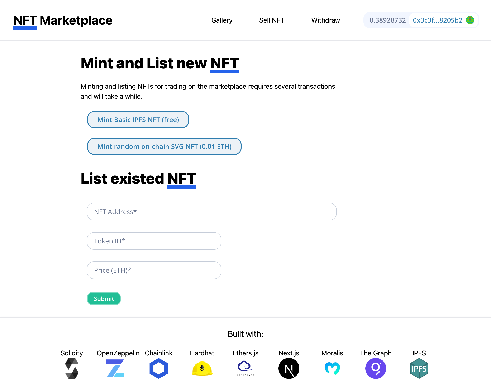

# NFT Marketplace Next.js

> *This is an educational project with the purpose of acquiring hands-on experience in web3 application development using smart contracts written in Solidity.*

The NFT Marketplace project consists of 3 parts:

[Hardhat App](https://github.com/v7m/nft-marketplace-hardhat): This component is responsible for managing smart contracts and includes deployment scripts, using the popular development environment for Ethereum smart contracts.

[Next.js App](https://github.com/v7m/nft-marketplace-nextjs): This part serves as the frontend of the application and interacts with on-chain logic within the Ethereum ecosystem.

[The Graph App](https://github.com/v7m/nft-marketplace-graph): This component handles the storage and indexing of blockchain events. The Graph is a widely used indexing and querying protocol for blockchain data.

<p float="left">
    
    
</p>

## NFT Marketplace Features:

- Compatible with various web3 wallets.
- Trade various NFT types: Basic (IPFS hosted) and Dynamic SVG (on-chain storage).
- Buy NFT tokens listed by others or set your own price when selling.
- Easily modify your price or cancel a listing for your tokens at any time.
- Users can mint and list new NFTs directly within the marketplace.
- Sellers have full control over their trading earnings, which are withdrawable at any time.

## Built with:
- Solidity
- OpenZeppelin
- Chainlink VRF
- Hardhat
- Ethers.js
- Next.js
- Moralis
- The Graph
- IPFS

# Getting Started

```
git clone https://github.com/v7m/nft-marketplace-nextjs
cd nft-marketplace-nextjs
yarn
```

# Usage

## Deploy subgraph

Follow the instructions of the [README](https://github.com/v7m/nft-marketplace-graph) of The Graph repo.

## Start development server:

Please ensure the following:

1. In the `networkMapping.json` file within the `constants` directory, you have the contract addresses for `NftMarketplace`, `BasicIpfsNft`, and `DynamicSvgNft` on the localhost Sepolia network.

2. In the same directory, make sure you have the contracts' ABIs stored in `NftMarketplaceAbi.json`, `BasicIpfsNftAbi.json`, and `DynamicSvgNftAbi.json` files.

3. Ensure that you have defined a `NEXT_PUBLIC_SUBGRAPH_URL` in your `.env` file, which should be obtained from The Graph app.

```
yarn dev
```
